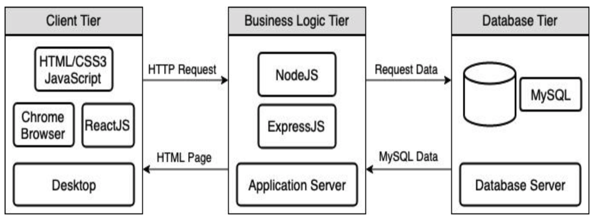

# Three-tier Architecture

We separated our app into three different physical deployment tiers.

- **Presentation:** we have two clients
  - Web client (React); pictured above
  - Mobile client (React Native); would be an extra box in the above figure communicating to the Business Logic Tier 
- **Business Logic:** Express.js and Node.js 
  - Handles for example the routing and our scheduling algorithm
- **Persistence:** MySQL RDS database instance

## Why we chose this architecture

- We can work on different tiers at the same time
- Highly scalable
  - Each tier can be stored in separate instances and resources given to each instance can be scaled based on load
- Separation of concerns
- We can have multiple front-ends communicating to the same logic server (improving consistency)

Please refer to our [technologies used document](technologies-used.md) for more information on the motivations behind our choices. 

