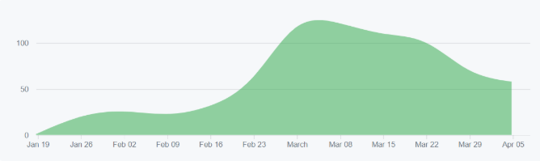
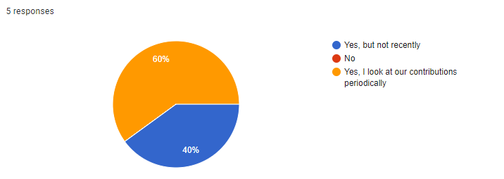

# Survey on our Group Contributions 

This survey was performed at the end of the project about the following graph (collective commits to the repository):

## Have you seen this graph before?

## Does this graph concern you? Why or why not?

- No - It looks fine as is. It shows that we contributed a good amount as a team.
- We should have done more development in the beginning...
- Wish that hump appeared earlier
- A bit but I feel like for most projects the work tends to ramp up closer to the due date
- In part. Contributions don't mean everything, and we had other stuff we were doing at the time (activities, project planning). However, it does indicate the problems we had with take off at the beginning: I think we definitely (most of us) did not put a lot of time into it at the beginning, there was bad work distribution, lack of leadership, as someone said in the previous retrospective, groups have a natural ramp up time both in getting to understand each other (work style and process) and also just our natural ramp up time in getting familiar with our tools (which took forever; it's the worst part of development).

## Why do you think we have such a steep curve in late February? What are some reasons we didn't develop much in the first months?

- We felt that we couldn't finish what we envisioned in time, let alone the MVP. We originally thought it was easy to accomplish.
- People didn't really know how to start. Technologies were new. We needed time to learn and ramp up
- Once Earl + Daryl had things set up and running smoothly, development became smoother and had fewer unknowns.
- The learning curve for the technologies we used probably contributed to it
- I think there was a cascading set of reasons. Lack of leadership >> lack of more planning, lack of thought out assignment of tasks >> bad work distribution >> low truck number, low levels of ownership for many of us, long setup time for many of us, lack of understanding what we were working with >> people didn't start coding until we had more time (that steep curve starts right on reading week and you can see it grow quickly after that - I think many of us got comfortable with the code base during that week). 
- Earl makes as little commits as he can or the beginning would probably be higher than it looks (but our problems would still be there so the graph is nice to think about still)

## We waited on a lot of the server/database/pipeline stuff to be done before really beginning UI development. Why do you think that was? Was it on purpose, partially on purpose, or did it just happen?

- Waiting for the server/database/pipeline stuff allowed us to give an idea on how to structure the UI to pass data from/to the server. It also allows us to work on the features in a more convenient way (ex: quick reload with docker, can finish a feature rather than waiting for the server to work, don't have to refactor as much to fit the server if we did worked on it before it was finished, etc.)
- I don't think it was on purpose. I think it was done unintentionally. Since we didn't really understand how the app was going to be structured, we didn't start coding until we were confident about the server/database/pipeline
- https://github.com/Syndrical/scheduler-app/pull/5 took us a while to get merged which blocked a lot of other UI related development, since it laid out a lot of what our web client was going to look like (from the start at least). Mobile we switched to React Native, so that also impacted development.
- I think we wanted the database to be set up so we could get to know what we were working with for UI. We didn't actually need it to start work on UI, but we kind of had the feeling we did. I think we also felt we needed our CI stuff in place before we actually started coding. In retrospect, that wasn't necessary but again it felt like it was at the time/that it would make our coding so much easier for some reason.

