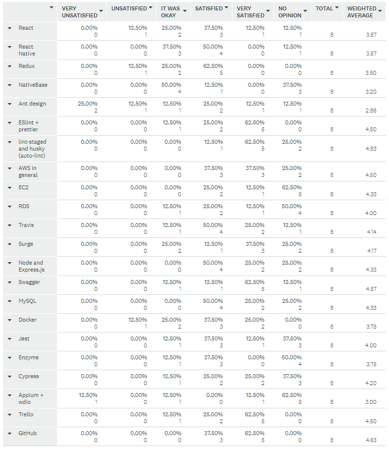
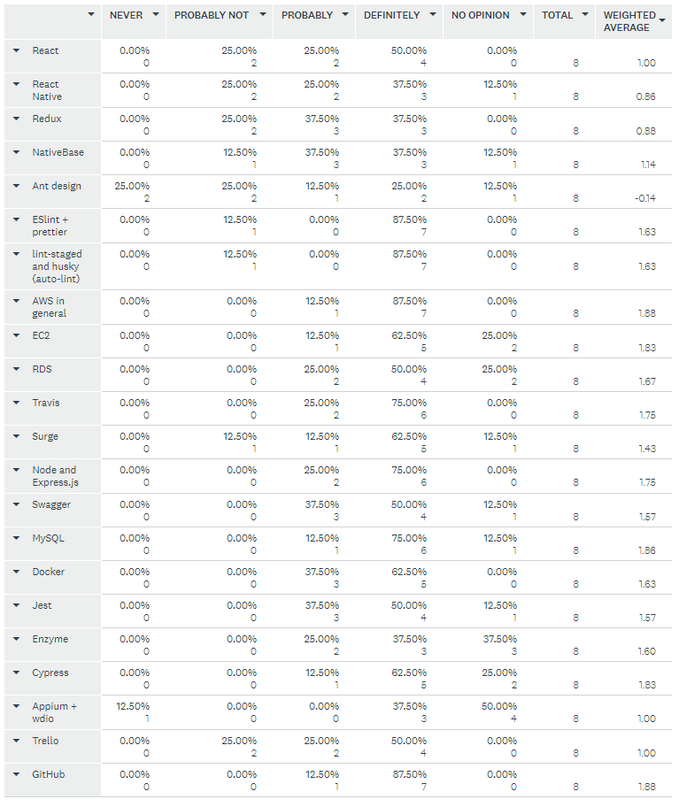

# Survey on our Technologies

This survey was performed at the end of the project.

### On reflection, how satisfied are you with these technologies? Please consider the use of these technologies in this project only (for example, if you liked React when you did a different project but hated using it for this one, you would score it as "very unsatisfied")

 

### Would you consider using these technologies for a future project?

### If we continued with this project long-term, would you consider changing any of the chosen technologies?

- At this point, maybe not. We already did a lot of work on making ant-d responsive and we have most of our main pages set. If we were looking at adding several more pages or at changing out layout, I would definitely consider switching from ant-d to something more responsive and which has a better grid system. I would also consider switching from Trello to something else. Trello did not have all the functionality I wanted and our group doesn't use it as much as I'd like either, and I think switching to something else may help.
- Redo the Web UI with a different UI library. And also change the mobile app from React Native CLI to Expo CLI
- Move from Trello to GitHub

